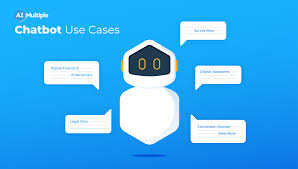

    <h1>Generating Chatbot👩🏻‍💻</h1>

**Abstract:** 
At the most basic level, a chatbot is a computer program that simulates and processes human conversation (either written or spoken), allowing humans to interact with digital devices as if they were communicating with a real person. Chatbots can be as simple as rudimentary programs that answer a simple query with a single-line response, or as sophisticated as digital assistants that learn and evolve to deliver increasing levels of personalization as they gather and process information. 

You’ve probably interacted with a chatbot whether you know it or not. For example, you’re at your computer researching a product, and a window pops up on your screen asking if you need help. Or perhaps you’re on your way to a concert and you use your smartphone to request a ride via chat. Or you might have used voice commands to order a coffee from your neighborhood café and received a response telling you when your order will be ready and what it will cost. These are all examples of scenarios in which you could be encountering a chatbot.

**Applications:** 

## How do chatbots work??
Driven by AI, automated rules, natural-language processing (NLP), and machine learning (ML), chatbots process data to deliver responses to requests of all kinds. There are two main types of chatbots.

- Task-oriented (declarative) chatbots are single-purpose programs that focus on performing one function. Using rules, NLP, and very little ML, they generate automated but conversational responses to user inquiries. Interactions with these chatbots are highly specific and structured and are most applicable to support and service functions—think robust, interactive FAQs. Task-oriented chatbots can handle common questions, such as queries about hours of business or simple transactions that don’t involve a variety of variables. Though they do use NLP so end users can experience them in a conversational way, their capabilities are fairly basic. These are currently the most commonly used chatbots.

- Data-driven and predictive (conversational) chatbots are often referred to as virtual assistants or digital assistants, and they are much more sophisticated, interactive, and personalized than task-oriented chatbots. These chatbots are contextually aware and leverage natural-language understanding (NLU), NLP, and ML to learn as they go. They apply predictive intelligence and analytics to enable personalization based on user profiles and past user behavior. Digital assistants can learn a user’s preferences over time, provide recommendations, and even anticipate needs. In addition to monitoring data and intent, they can initiate conversations. Apple’s Siri and Amazon’s Alexa are examples of consumer-oriented, data-driven, predictive chatbots.

## Built with
<code></code>
<code></code>
<code></code>
<code></code>
<code></code>
<code></code>
<code></code>

### © 2022 Arushi Garg- GDSC

## Thank You! Show some :heart: if you like it!
